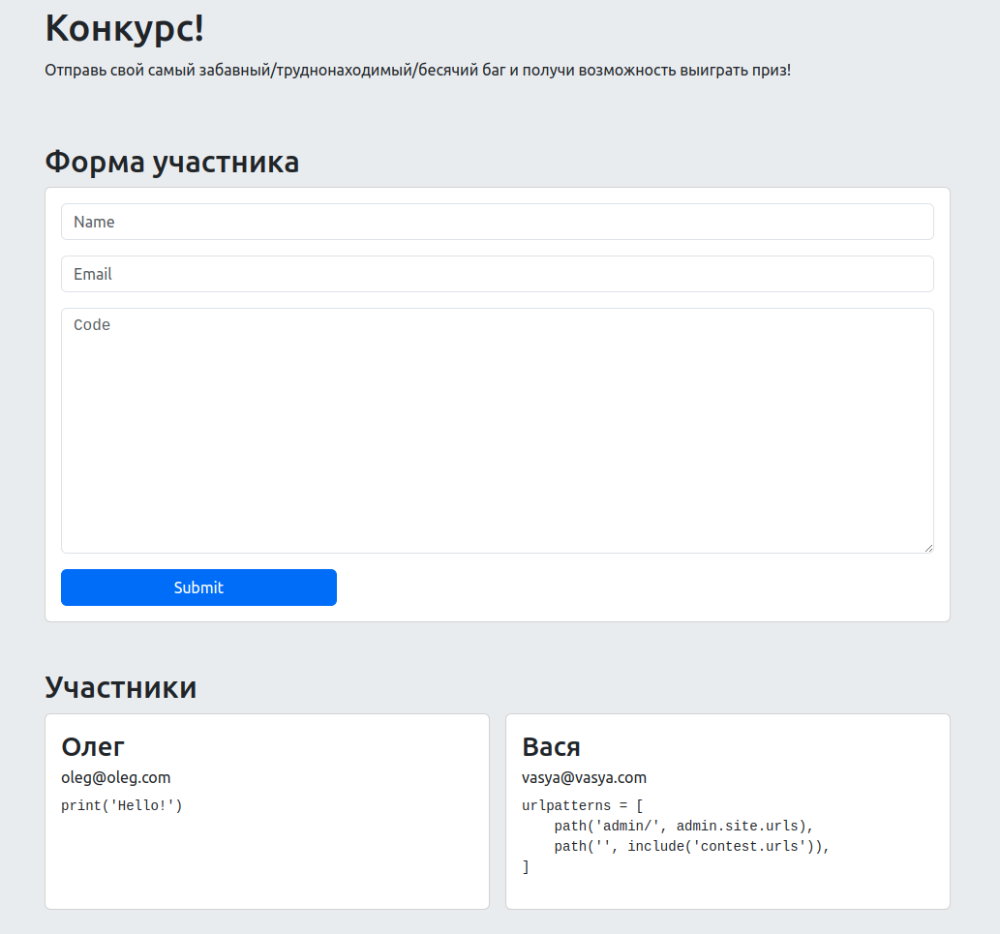

# Тестовое задание на Web-разработчика

Привет! Наша команда подготовила для тебя небольшой проект, на котором нужно выполнить пару заданий.

Желаем успехов!

## Описание проекта

Это проект на __Django__, завернутый в __Docker__. Запуск проекта производится командой:

```docker compose up```

Проект запустится на порту __1337__.

Доступна только одна корневая страница, на которой и нужно выполнить задания.

Для стилизации подключен __Bootstrap 5__, предлагаем его и использовать при верстке.

## Задания

Для выполнения заданий создай новый репозиторий используя этот __шаблон__ (инфа про шаблоны в GitHub - [тык](https://docs.github.com/en/repositories/creating-and-managing-repositories/creating-a-repository-from-a-template#creating-a-repository-from-a-template)), как справишься - присылай ссылку нам в hh. Проект сделай публичным, чтобы мы могли проверить его :D

### 1. Сверстать форму участника

В проекте есть модель данных `Participant` - это участник конкурса, который оставляет заявку через форму на странице. Для начала форму надо сверстать, поля следующие:

- name - обычное текстовое поле
- email - поле email-а
- code - поле для текста со множеством строк

Внешний вид формы можно подсмотреть на скрине после заданий.

### 1.1. Прикрутить отправку формы

Форму мало сверстать, надо чтобы она сохраняла данные в админку. В админке уже есть вывод участников, осталось сделать так, чтобы форма на странице умела сохранять введенные данные:

- Форма должна __сохранять__ данные
- Данные формы должны проходить __валидацию__, после чего нужно вывести сообщения об ошибках. Валидации на уровне модели данных будет достаточно, сообщения можно выводить под соответствующими полями
- Если форма сохранилась, нужно вывести сообщение "Спасибо за участие!" около кнопки "Submit"
- Отправку можно сделать с перезагрузкой страницы. Так проще

### 2. Сделать вывод участников

Под формой нужно вывести список участников, которые уже ранее отправили заявку. Внешний вид можно подсмотреть на скрине после заданий.

## Вид страницы



Тк для выполнения заданий мы предоставляем только скриншот, то о ни каком pixel-perfect речи и не идет. Главное чтоб было функционально :)

## Что будет оцениваться

- Соответствие ТЗ
- Адаптивность - страница должна одинаково хорошо работать как на мобилках, так и на десктопах
- История коммитов

## Необязательно, но если очень хочется

Здесь собраны фичи, которые совсем необязательно делать, но сделают проект чуть лучше:

- Инлайн валидация полей
- Ввод кода с подсветкой в форме
- Аяксовая отправка формы, чтоб не перезагружать страницу. Тогда можно и салют после успешной отправки формы сделать
- Подсветка кода участников в списке